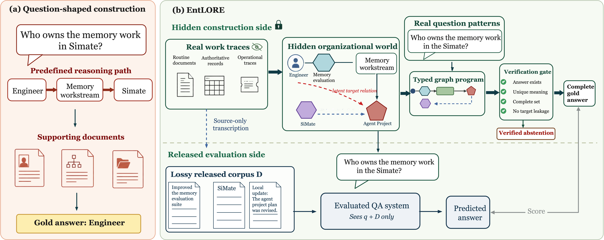
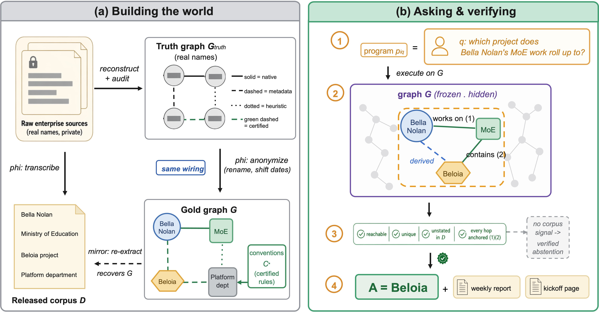
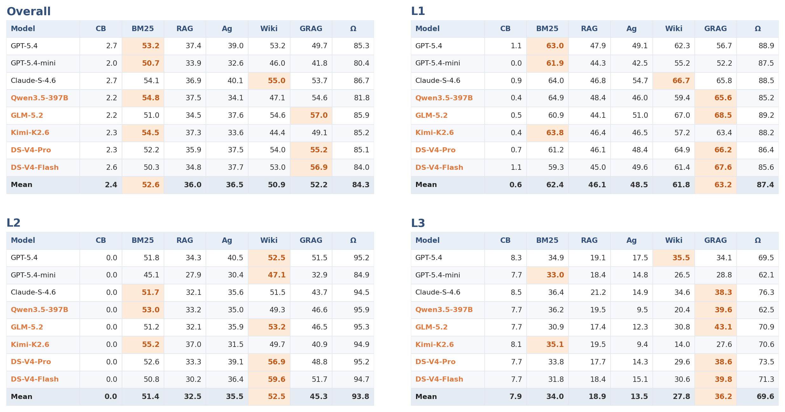
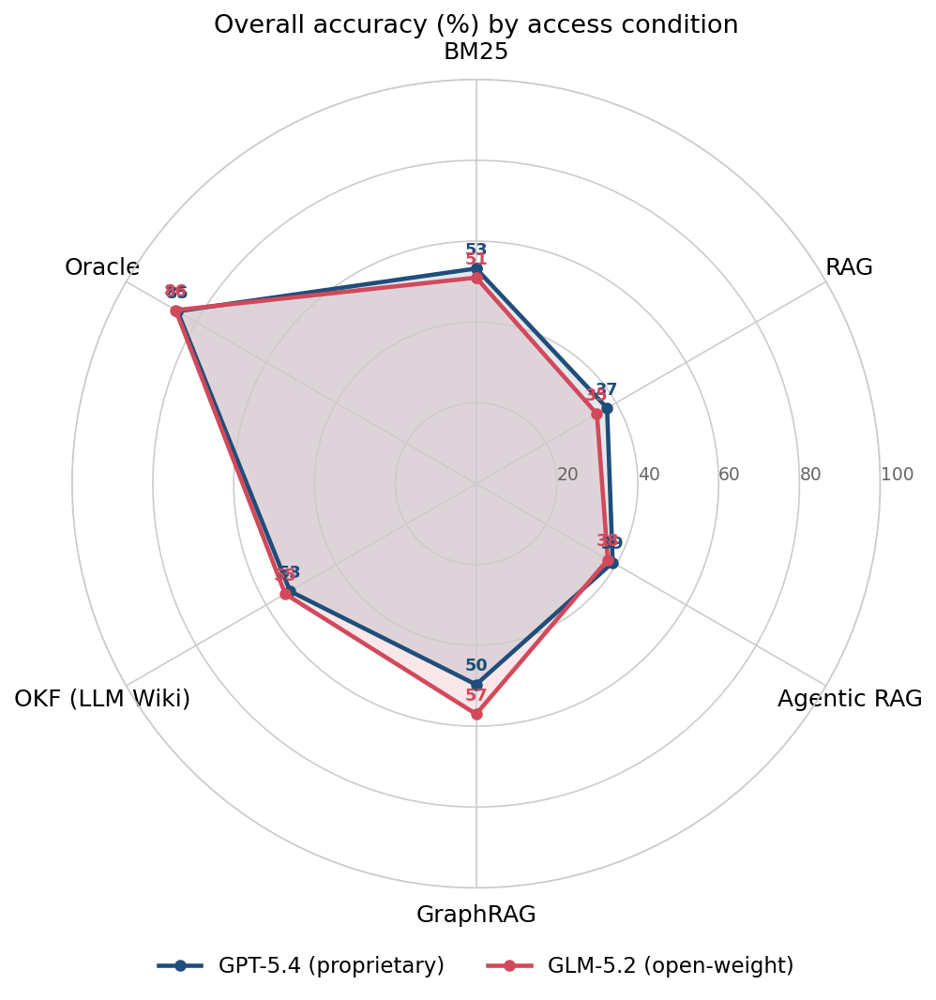

<div align="center">
  
</div>

<h1 align="center">🏛️ EntLORE</h1>
<h3 align="center">A Graph-Grounded Benchmark for Latent Organizational Reasoning<br>in Enterprise Question Answering</h3>

<div align="center">
  
  
  
  
  
  <a href="https://arxiv.org/abs/XXXX.XXXXX"></a>
</div>

<div align="center">
  <b>🏢 Official code &amp; data repository</b> for the paper<br>
  <i>EntLORE: A Graph-Grounded Benchmark for Latent Organizational Reasoning in Enterprise Question Answering</i>
</div>

<div align="center">
  Akrin Zheng<sup>*</sup> &nbsp; Alexander Wu<sup>*</sup> &nbsp; Alaia Liu<sup>*†</sup> &nbsp;—&nbsp; <b>ScitiX.ai</b><br>
  <sub><sup>*</sup> Equal contribution &nbsp;·&nbsp; <sup>†</sup> Corresponding author: <a href="mailto:alaia@scitix.ai">alaia@scitix.ai</a></sub>
</div>

<div align="center">
  📄 <b>Paper:</b> <a href="paper/EntLORE.pdf">PDF</a> &nbsp;·&nbsp; <a href="https://arxiv.org/abs/XXXX.XXXXX">arXiv:XXXX.XXXXX</a> &nbsp;·&nbsp; 📊 <b>Data &amp; code:</b> this repository
</div>

> **TL;DR** — Enterprise answers often depend on *organizational relations* that no single document
> states. EntLORE reconstructs an **audited enterprise truth graph** from routine documents,
> authoritative tables, and operational records, then releases an anonymized document world whose
> gold answers and proofs are computed from the graph — while the target derived relations are
> **withheld from evaluated systems**. Across 8 models × 7 knowledge-access conditions, **how the
> released world is *organized* matters more than how much retrieval *machinery* is applied to it** —
> and even perfect evidence leaves latent-relation questions unanswered.

---

## 🧭 Overview

Enterprise question answering is usually framed as *retrieve relevant internal documents, then
generate a grounded answer*. But routine enterprise records are produced as **by-products of
work**, not self-contained descriptions. Many questions therefore cannot be answered from an
explicitly stated fact or a fixed chain of passages — their answers depend on relations that
connect local activities, internal terminology, project hierarchies, and ownership across
heterogeneous sources. We call this task **implicit enterprise process question answering** and
the missing capability **latent organizational reasoning**.

EntLORE is a **graph-grounded construction framework** that:

1. **Reconstructs an audited truth graph** from real enterprise documents, authoritative
   organizational tables, and operational records — separating *native*, *metadata*, *heuristic*,
   and *certified derived* relations.
2. **Derives only human-authorized relations** through versioned, organization-specific convention
   cards, yielding complete **golden answers and proof certificates**.
3. **Releases aligned, anonymized views** — the document corpus — while **withholding private
   structure and the target derived relations** from the systems under evaluation.

The released benchmark contains **2,341 documents** across **three enterprise source types**
(1,194 weekly reports · 794 knowledge-base pages · 353 incident tickets) and **907 questions**
spanning explicit lookup, cross-source composition, latent organizational reasoning, exhaustive
aggregation, evidence acquisition, and answer generation. The full evaluation matrix is **56
configurations** (8 answer models × 7 knowledge-access conditions).

## 🏗️ How EntLORE is built

<div align="center">
  
</div>

Construction runs as a **deterministic pipeline**, not manual labelling:

1. **Reconstruct a raw graph** from heterogeneous enterprise sources (routine documents,
   authoritative organizational tables, operational records).
2. **Certify derived relations.** Audited, versioned organizational conventions add *certified
   inference edges*, turning the raw graph into a **truth graph**.
3. **Release an aligned, anonymized corpus.** A shared anonymization map produces the public
   document corpus; the private organizational records, certification rules, and the truth graph
   itself **stay hidden**.
4. **Compute answers with typed graph programs.** These derive each gold answer and *verify* its
   derivation — completeness, uniqueness, and **absence of the target relation from the released
   documents** — so every question's answerability and evidence chain are code-traceable.

## 🔑 Key findings

- **Access *organization* beats retrieval *machinery*.** All five deployable conditions read the
  same corpus and differ only in how they index and present it. They split into two far-apart
  tiers: **BM25 (0.529), GraphRAG (0.522), LLM Wiki (0.509)** on top, **Agentic Retrieval (0.365)
  and flat dense RAG (0.360)** ~15 points below (tier-weighted overall).
- **Even perfect evidence leaves latent relations unanswered.** Supplying the gold documents
  (Oracle) still leaves **30.4% of latent (L3) questions unanswered**, versus **12.6%** for
  explicit (L1) and **6.2%** for compositional (L2) — the residual is *reasoning*, not retrieval.
- **Flat dense retrieval falls *below* a plain lexical index.** Released documents identify their
  organizational region through sparse anchors (project aliases, module names, ticket terms) that
  BM25 ranks first and a single dense space washes out.
- **Where documents stop helping, the ranking inverts.** 70% of L3 items resist flat retrieval
  (the target relation is stated in no released document). On that subset **GraphRAG leads (0.310)**
  and BM25 falls to 0.251 — GraphRAG answers with a relation it *materialized offline*, not by
  retrieving better. This is the sense in which EntLORE measures **relation recovery, not recall**.
- **A mismatched harness burns the budget reasoning would have used.** On non-retrievable L3 items,
  30-step agentic retrieval scores **0.088 — below the no-corpus closed-book floor (0.077)**.
- **The gap concentrates in hierarchy attribution.** Department attribution: lexical retrieval
  **0.02** vs. the induced graph **0.53**, on items the oracle answers 84% of the time.
- **Open-weight models match or surpass the proprietary frontier where it counts.** On
  corpus-induced GraphRAG — the strongest deployable condition — the top four scores on the
  hardest, latent-reasoning tier (L3) are all open-weight: **GLM-5.2 (0.431), DeepSeek-V4-Flash
  (0.398), Qwen3.5-397B (0.396), DeepSeek-V4-Pro (0.386)** — ahead of the best proprietary model
  (Claude-Sonnet-4.6, 0.383) and well ahead of GPT-5.4 (0.341). Kimi-K2.6 is the only model that
  leads with BM25 at all three levels. The proprietary edge appears only at the Oracle *ceiling*
  (Claude, 0.763 on L3) — raw synthesis given perfect evidence, not the retrieval-grounded settings
  a deployed system actually runs. **Organizing the knowledge well closes the open-vs-closed gap
  more than scaling the answer model does.**

## 📊 Main results

Answer accuracy (**%**) across all 8 answer models and 7 knowledge-access conditions, split into four
views: **Overall** (tier-weighted over L1 469 / L2 204 / L3 234) and per level. **Bold** = best
*deployable* condition per model (closed-book **CB** and Oracle **Ω** excluded from the comparison).
Columns: **CB** closed-book · **Ag** agentic retrieval · **Wiki** LLM Wiki · **GRAG** GraphRAG ·
**Ω** Oracle ceiling (*n*=216 on L3).

<div align="center">
  
</div>

*No single condition owns a level — structural access (GraphRAG / LLM Wiki) leads L2/L3, lexical BM25 is strongest on some L1 — and open-weight models take most of the bold cells.*

<div align="center">
  
</div>
<div align="center">
  <sub>Overall (tier-weighted) accuracy of a representative <b>open-weight</b> model (GLM-5.2) vs a
  <b>proprietary</b> flagship (GPT-5.4) across the six access conditions. The open model leads on the
  structured substrates (GraphRAG, OKF) and ties at the Oracle ceiling; the proprietary model edges ahead
  only on flat retrieval (BM25 / RAG / agentic).</sub>
</div>

## 📦 What's in this repository

| Path | Contents |
|---|---|
| `dataset/corpus/` | 2,341 markdown documents (1,194 reports · 794 knowledge-base · 353 tickets) |
| `dataset/questions.json` | 907 questions (`{id, question}`) |
| `dataset/golden_packets.jsonl` | 907 gold packets — required facts, evidence pointers, proof/scoring mode |
| `dataset/SCHEMA.md` | field-level schema for the dataset |
| `src/baselines/` | the 7 access conditions + oracle upper bounds (self-contained) |
| `src/evaluator.py` | deterministic gates + LLM-judge scorer |
| `scripts/` | `build_indexes.py`, `run_eval.py`, `score.py`, `smoke.sh` |
| `third_party/` | vendored GraphRAG (MIT) and OKF (Apache-2.0) |

**Question tiers.** L1 (explicit fact, 469) · L2 (compose across facts, 204) · L3 (derive a latent
relation, 234). 62 operators (question types); 18 verified-unanswerable questions (abstention).
The truth graph behind construction holds **1,153 entities and 3,784 typed relations**.

**Access conditions** (paper name ↔ baseline id):

| Condition | Baseline id | Measures |
|---|---|---|
| Closed-book | `closed_book` | parametric-memory floor (no retrieval) |
| BM25 | `bm25` | naive sparse lexical retrieval |
| RAG | `rag` | flat dense top-*k* single-turn retrieval |
| Agentic Retrieval | `agentic_rag` | multi-turn autonomous tool loop over the dense index |
| LLM Wiki | `okf` | navigation loop over an LLM-compiled offline knowledge base |
| GraphRAG | `graphrag` | dual-tool loop over an induced entity graph + Leiden community reports |
| Oracle Ω | `oracle_rag` / `oracle_agentic_rag` / `oracle_okf` | perfect-evidence ceilings (gold packet fed directly) |

---

## ⚙️ Requirements

- **Python 3.10+**, then `pip install -r requirements.txt`. Core dependencies: `openai`,
  `anthropic`, `httpx`, `tenacity`, `numpy`, `PyYAML`. `networkx` and `graspologic` are needed
  **only** to build the GraphRAG index.
- **API access, not local GPUs.** All generation and embedding calls go through remote endpoints:
  an OpenAI-compatible endpoint (`API_BASE`) for chat + embeddings, and optionally an Anthropic
  endpoint (`ANTHROPIC_BASE_URL`) for Claude models and the default judge. No model weights run
  locally.
- **Disk.** The dataset is ~15 MB. Retrieval indexes are *not* shipped and are rebuilt locally
  (`scripts/build_indexes.py`): bm25/rag are a few hundred MB; the OKF/GraphRAG substrates can
  reach ~1–4 GB.
- **Memory.** bm25 / rag / closed-book run in a few GB of RAM; loading the GraphRAG index for
  evaluation is heavier — plan for ~16 GB if you use the `graphrag` condition.
- **OS.** Developed and tested on Linux (x86-64); macOS works. No CUDA required.

## 🚀 Getting started

```bash
pip install -r requirements.txt
cp .env.example .env          # fill in your API endpoint(s) + model names
```

Model calls go through `src/llm.py`: point `API_BASE` at any OpenAI-compatible endpoint and
`ANTHROPIC_BASE_URL` at Anthropic (or a compatible relay). Endpoint routing is by model-name prefix
— `claude*` uses the Anthropic native protocol, everything else uses the OpenAI-compatible endpoint.

### 🔥 Smoke test first (a few cents)

> [!TIP]
> Verify your credentials and the whole build→run→score wiring end-to-end on the 5-question subset
> (`dataset/smoke.json`) **before** spending budget on the full run. It uses only `closed_book` +
> `bm25`, so **no embedding endpoint is needed**.

```bash
scripts/smoke.sh <your-model>   # ~10 chat + ~10 judge calls
```

A clean pass writes `runs/smoke/score_summary.json` with `"complete": true`. A nonzero `bm25` mean
means retrieval + scoring work; `closed_book` is expected near 0.

### 🧪 Full evaluation

```bash
# 1) build retrieval indexes (bm25/rag are fast; okf/graphrag are heavier, many LLM calls)
python scripts/build_indexes.py --baseline bm25,rag        # add okf,graphrag for the structured conditions

# 2) run a model over the access conditions
python scripts/run_eval.py --models <your-model> \
    --pipes closed_book,bm25,rag,agentic_rag,okf,graphrag,oracle_rag \
    --questions dataset/questions.json --out runs/main --workers 32

# 3) score (deterministic gates + LLM judge; set JUDGE_MODEL in .env)
python scripts/score.py --root runs/main --models <your-model> \
    --pipes closed_book,bm25,rag,agentic_rag,okf,graphrag,oracle_rag \
    --bank dataset/golden_packets.jsonl --questions dataset/questions.json
```

All paths and parameters are overridable via `EKWB_*` environment variables (single table in
`src/baselines/config.py`).

<details>
<summary>⚙️ <b>Configuration notes (build model, concurrency, thinking models)</b></summary>

- **`okf` / `graphrag` build model.** `bm25` uses no LLM and `rag` only calls the embedding endpoint
  (`EMBED_MODEL`); the `okf`/`graphrag` compilers run an LLM per document using **`CHAT_MODEL` from
  `.env`** (recorded as `build_model` in their manifests). `build_indexes.py --model` /
  `EKWB_SUT_MODEL` set the *answering* model and do **not** change the compiled index. An
  OpenAI-family `CHAT_MODEL` builds fine — routing is by name prefix.
- **Concurrency.** `run_eval.py --workers N` (default 32) sets question-level fan-out.
  `LLMWIKI_MAX_CONCURRENCY` (env) governs index build, embedding, and the judge. A comma-separated
  `API_KEY=k1,k2,k3` round-robins across keys to raise the effective rate limit. **Single-key
  users:** keep `--workers` ≈ 4–8 and `LLMWIKI_MAX_CONCURRENCY` low to avoid rate-limit errors.
- **Thinking models.** Set `EKWB_NO_THINK=1` to inject `enable_thinking=false` for open "thinking"
  models (Qwen/GLM) that otherwise burn their token budget on hidden reasoning and return empty
  completions. It is a no-op for `gpt-5*` and `claude*`.

</details>

### 🔌 Bring your own system

Your system only needs to read `dataset/corpus/` and the question text in `dataset/questions.json`,
then emit one answer per question. Score it with `scripts/score.py` against
`dataset/golden_packets.jsonl`. To add it as a baseline, subclass `Baseline` and register with
`@register("name")` (see `src/baselines/`).

## 🔖 Citation

If you use EntLORE, please cite:

```bibtex
@article{entlore2026,
  title   = {{EntLORE}: A Graph-Grounded Benchmark for Latent Organizational
             Reasoning in Enterprise Question Answering},
  author  = {Zheng, Akrin and Wu, Alexander and Liu, Alaia},
  journal = {arXiv preprint arXiv:XXXX.XXXXX},
  year    = {2026}
}
```

<sub>The arXiv identifier and paper link will be filled in once the preprint is posted.</sub>

## 📜 License & data statement

Code is released under the **MIT License** (see [`LICENSE`](LICENSE)). The corpus is **fully
synthetic and anonymized** (English): an audited real enterprise world is reconstructed into a
fictional organization, with persons, projects, aliases, and dates mapped through a shared identity
map and private metadata never verbalized into the documents. See [`NOTICE`](NOTICE) for the full
data statement and the licenses of vendored components (`third_party/`).

<div align="center"><sub>Made with 🧠 &amp; 📈 by <b>ScitiX.ai</b></sub></div>
